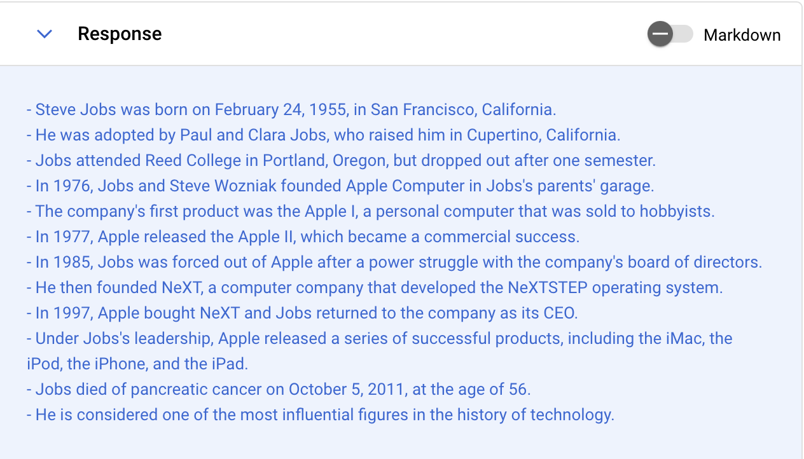
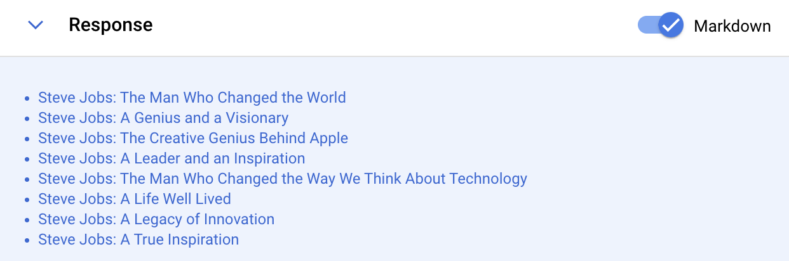
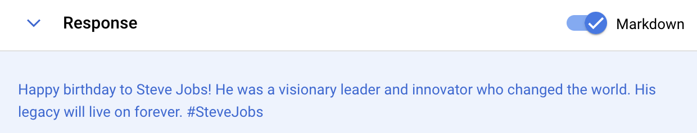
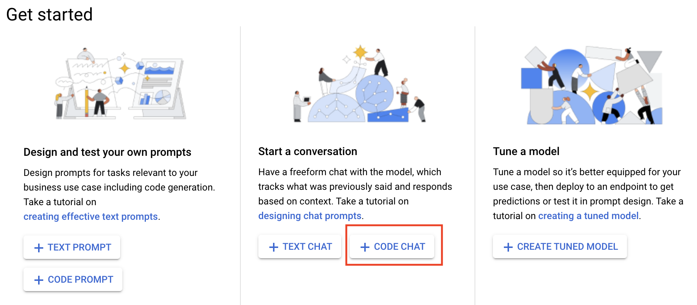
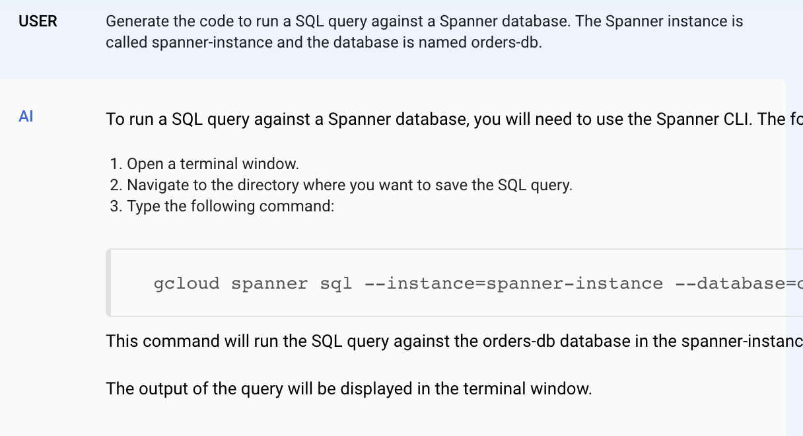

# Explore and Evaluate Models Using Model Garden

## Overview

You work for a real estate firm as a marketing analyst. Your company is intereseted in using Large Language Models to better help customers who access their website seeking home mortgage calculations based upon current interest rates and for brief text descriptions of homes they are interested in given their features. You have been tasked to create prompts that can respond to mortgage calculations and to summarize text from very long home descriptions from your real estate site. Home descriptions are stored in a file in a Google Cloud storage bucket. 

You are not certain what tools exist on Google Cloud, but you know that you can explore Model Garden to explore available models for your use. Due to the time you have to implement a solution, you want to look for pre-built models that can be leveraged as much as possible. Additionally, the request includes a requirement that you leverage the API directly rather than through a client library.

## Vertex AI

Vertex AI is Google Cloud's unified service for managing machine learning and generative AI projects. 
Vertex AI Model Garden is a collection of pre-trained machine learning models and tools that are designed to simplify the process of building and deploying machine learning models. It is a part of Vertex AI, Google Cloud's unified artificial intelligence platform.
Vertex AI Model Garden is a valuable resource for machine learning developers who are looking for pre-trained models and tools to accelerate their projects. It is a convenient and easy-to-use platform that can help you get started with machine learning quickly and easily.

Model Garden provides a single place to search, discover, and interact with a wide variety of models from Google and Google partners. These models cover a wide range of use cases, including computer vision, natural language processing, and tabular data analysis.

Model Garden also provides a variety of tools to help you use these models, including:

Model cards: Model cards provide detailed information about each model, including its accuracy, performance, and training data.
Prompt design: Prompt design allows you to interact with a model via a simple UI and tune the model with your own data.
Deployment: Model Garden can help you deploy your models to a production environment.


Gen AI Studio is a feature of Vertex AI. It makes writing and tuning prompts for text and code generation simple and intuative. 


Model Garden is a platform that helps you discover, test, customize, and deploy Vertex AI and select OSS models and assets. To explore the AI models and APIs that are available on Vertex AI, go to Model Garden in the Google Cloud console. One of the availble models through Model Garden is the Natural Language API. The Cloud Natural Language API lets you extract entities from text, perform sentiment and syntactic analysis, and classify text into categories.

However, in practice, these pre-built models may not be sufficient for all situations. AutoML uses machine learning to analyze the structure and meaning of text data. You can use AutoML to train an ML model to classify text data into categories which the Natural Language API was not trained to predict.
In this lab, you learn how to use Generative AI studio to create and experiment with prompts for various generative AI uses cases. You will explore the Gen AI Studio UI, and you will create text and code prompts and chats. 

## Objectives

In this lab, you learn how to:
* Understand how Vertex AI as an AI/ML Platform
* Explore Vertex AI Model Garden to find the appropriate model for your use case.
* Incorporate Model Garden in your machine learning workflow
* Navigate the Gen AI Studio user interface
* Create text prompts for the Generative AI lab use case
* Perform entity analysis
* Fine-tune models to meet your specific needs
  
## Setup and Requirements


![[/fragments/startqwiklab]]


![[/fragments/cloudshell]]


## Task 1: Learning the Gen AI Studio user interface

1. In the Google Cloud console, from the Navigation menu (), select __Vertex AI__ from the __Artificial Intelligence__ section. 

2. From the Vertex AI dashboard, click the __Enable all Recommended APIs__ button. 


3. In the __Tools__ pane on the left, click __Language__ from the __Generative AI Studio__ section. 

Here is the Generative AI Studio interface. 

 

Then, click __Text Prompt__ on the Get Started page. 


3. In the Prompt box type the following. and click __Submit__. Read the response. 

```
My credit score is 650
The home purchase price is 500,000
What is my estimated monthly mortgage payment on a 30 year loan at today's current interest rates?
```

4. Let's me more specific. Enter the following and click __Submit__. Examine the response.

```
My credit score is 650
The home purchase price is 500,000
What is my estimated monthly mortgage payment on a 30 year loan at today's current interest rates?
Show me some homes for sale in zip code 33020
```

5. In the properties pane on the right, increase the __Token Limit__ to 1024, and then submit the request again. Examine the results. 

6. Copy the entire response to the clipboard. Then, change the prompted to the following, and paste the previous response below it. 

```
Summarize the following in a few short bullets:

[PASTE PREVIOUS RESPONSE HERE]

```
The respose should be similar to what is shown below. 



7. The results are returned as Markdown. Click the __Markdown__ toggle to format the results. 

8. Click the __Save__ button in the Gen AI Studio toolbar. Name the prompt anything you like. Something like `Steve Jobs Prompt`  would be good. Once saved, prompts will be available be available in the __My Prompts__ tab of the Language page. 


## Task 2: Exploring Gen AI Use Cases

1. Summaries are a good use of Gen AI. Ideation is another. Ask the following.

```
What are some clever titles for a blog post about Steve Jobs?
```



2. Content creation is another good use of Gen AI. Ask the following. 

```
Write me a tweet to celebrate Steve Jobs' birthday.
```



3. Let's ask the model to be more creative. Enter the following and see what you get. 

```
Write me a poem about the life of Steve Jobs.
```

4. Classification is another Gen AI use case. Enter the following and see the results. 

```
Is the following comment positive or negative?

My iPhone is really great. I'm thankful to Steve Jobs for helping to create it. 
```

5. Change the comment to something negative and see if it returns the correct answer. 

6. Save your prompt again using the name `Steve Jobs Prompt 2`


## Task 3: Creating a Code Prompt

1. In the Tools pane on the left, click __Language__ from the __Generative AI Studio__ section as you did earlier. This time, click __Code Prompt__ on the Get Started page.


2. Ask the model to generate some code for you. Examine the results. 

```
What is the Terraform code for creating a Google Cloud VPC with subnets in us-central1 and us-east4?
```
3. Save your prompt, name it something like `My Code Prompt`.


## Task 4: Creating a Code Chat

1. In the Tools pane on the left, click __Language__ from the __Generative AI Studio__ section as you did earlier. This time, click __Code Chat__ on the Get Started page.



2. In the prompt text box enter the following and submit it. 

```
Generate the code to run a SQL query against a Spanner database. The Spanner instance is called spanner-instance and the database is named orders-db.
```

3. The results should be similar to what is shown below. 



4. Ask for a different language. 

```
Can you give me that code in Go?
```

5. Save your prompt as you did before, name this one something like `My Code Chat`.

## Bonus: Here are some links to Vertex AI Model Garden
Vertex AI Model Garden website: https://cloud.google.com/model-garden
Vertex AI Model Garden documentation: https://cloud.google.com/vertex-ai/docs/start/explore-models
Vertex AI Model Garden blog post: https://cloud.google.com/blog/products/ai-machine-learning/vertex-ai-model-garden-and-generative-ai-studio

## Bonus: Exploring Gen AI Studio

1. Create some more prompts. Experiment with different use cases and questions. 

### **Congratulations!** You have used Generative AI studio to create and experiment with prompts for various generative AI uses cases. You also explored the Gen AI Studio UI, and created text and code prompts and chats. 


![[/fragments/endqwiklab]]

![[/fragments/copyright]]
