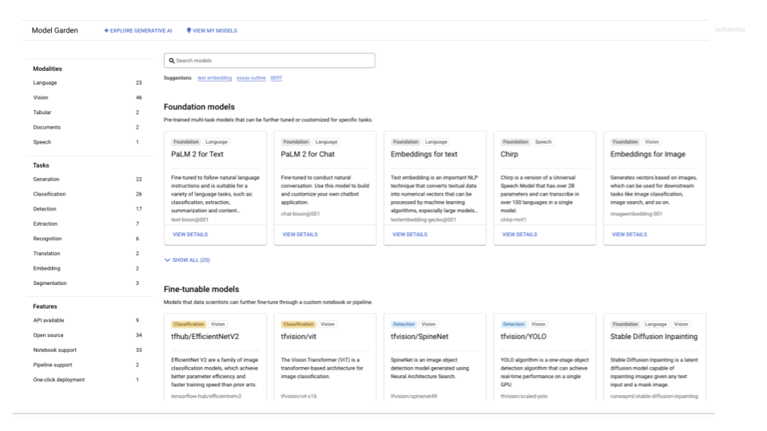
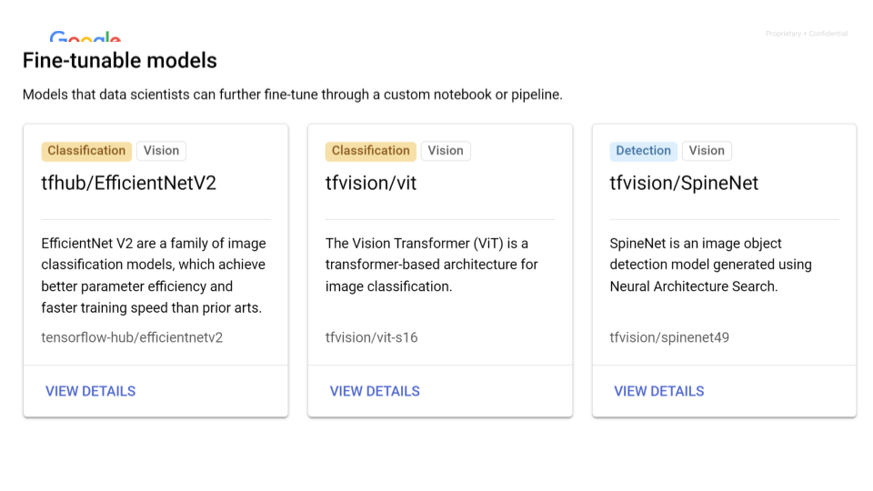
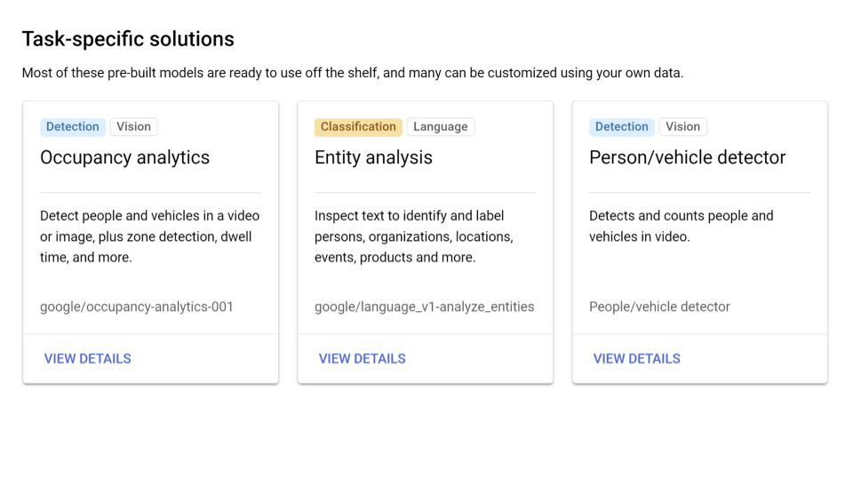
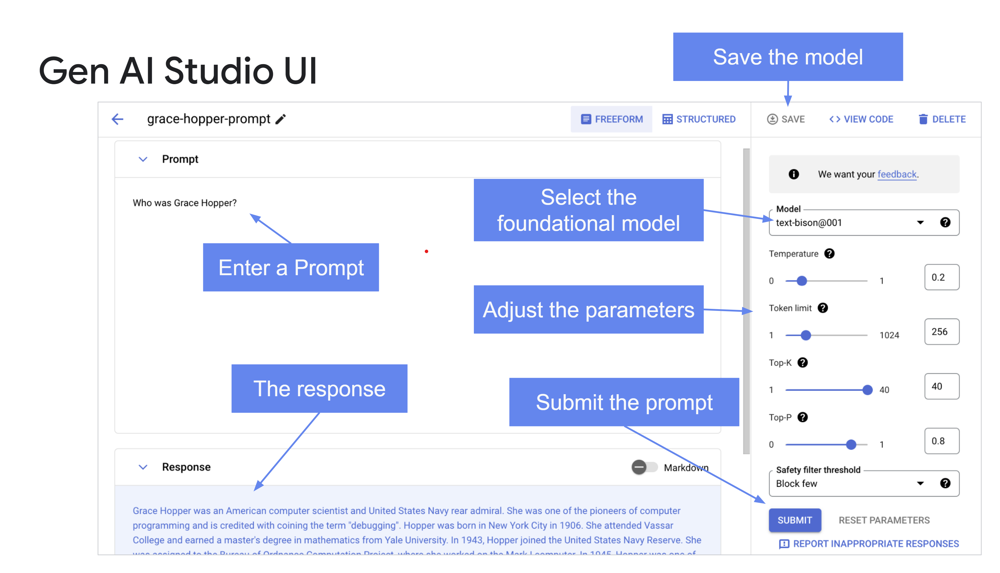
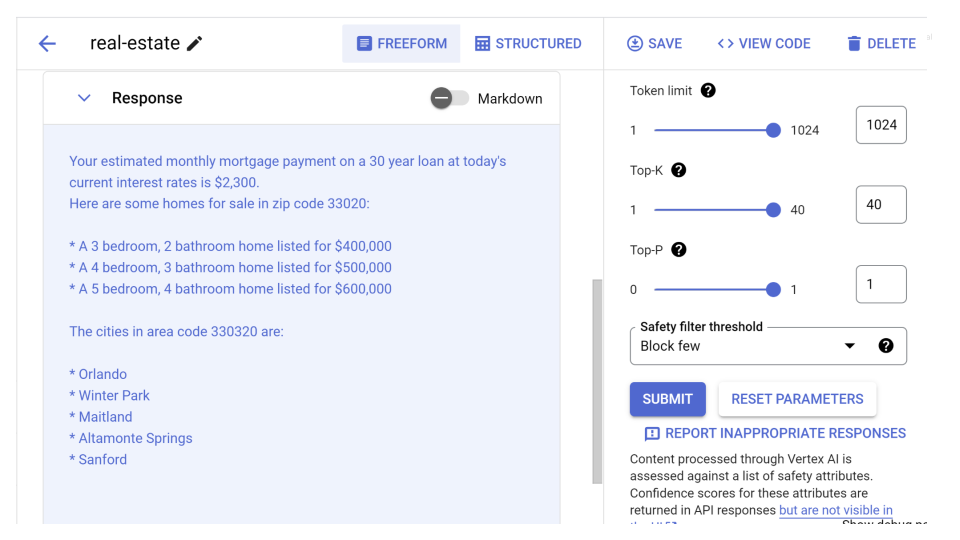
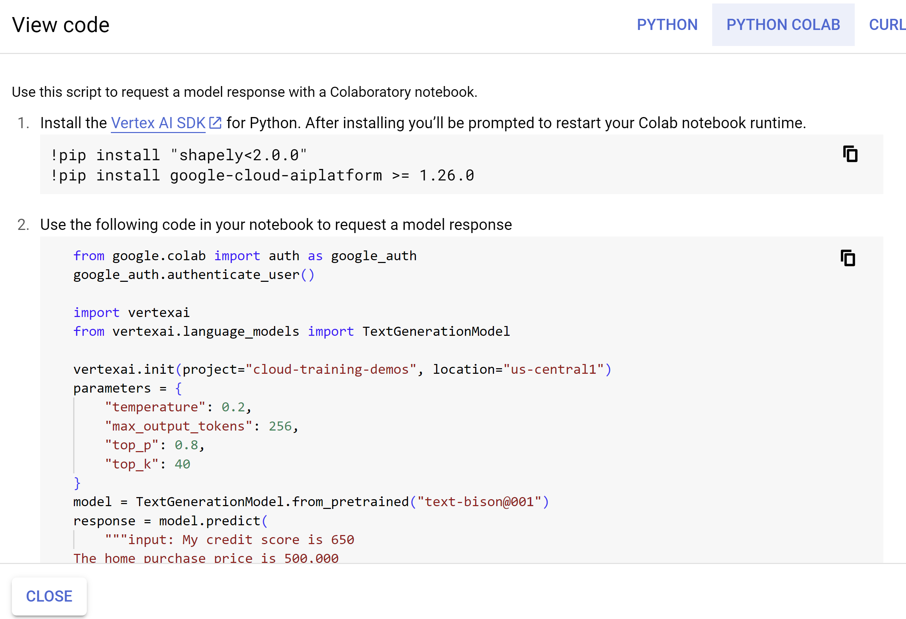
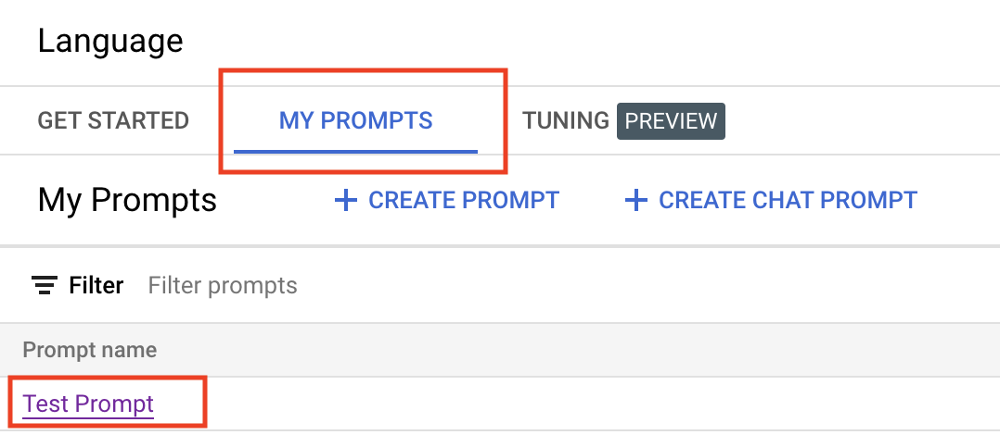
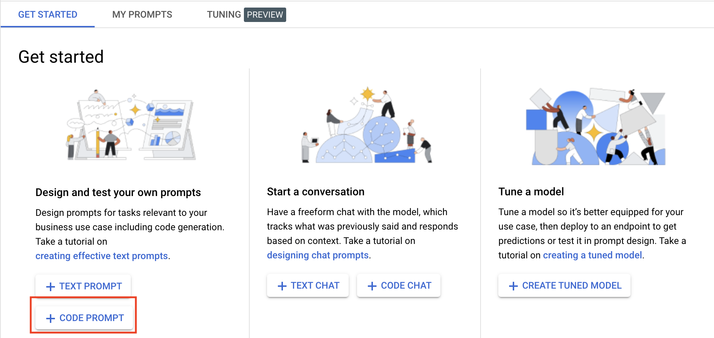
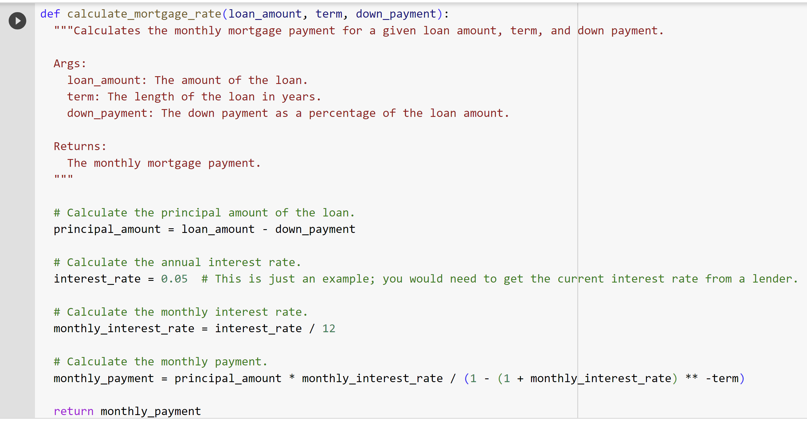

# Explore and Evaluate Models Using Model Garden

## Overview

You work for a real estate firm as a marketing analyst. Your company is intereseted in using Large Language Models to better help both home buyers and sellers who access their website seeking home mortgage information - (1) Mortgage calculations based upon current interest rates and (2) Brief text descriptions of homes they are interested in given their features. The realtors on your team are also interested in this information to better help them with pricing discussions with both buyers and sellers. You have been tasked to create prompts that can respond to mortgage calculations and to summarize text from very long home descriptions from your real estate site. Home descriptions are stored in a file in a Google Cloud storage bucket. 

You are not certain what tools exist on Google Cloud, but you know that you can explore Model Garden to explore available models for your use. Due to the time you have to implement a solution, you want to look for pre-built models that can be leveraged as much as possible. 

## Vertex AI

Vertex AI is Google Cloud's unified artificial intelligence platform for managing machine learning and generative AI projects. Vertex AI Model Garden is a collection of pre-trained machine learning models and tools that are designed to simplify the process of building and deploying machine learning models. Model Garden is a convenient and easy-to-use platform that can help you get started with machine learning quickly and easily.

## Model Garden

Model Garden provides a single place to search, discover, and interact with a wide variety of models from Google and Google partners. These models cover a wide range of use cases, including computer vision, natural language processing, and tabular data analysis. Model Garden also provides a variety of tools to help you use these models, including:
**Model cards**: Model cards provide detailed information about each model, including its accuracy, performance, and training data.
**Prompt design**: Prompt design allows you to interact with a model via a simple UI and tune the model with your own data.
**Deployment**: Model Garden can help you deploy your models to a production environment.

One of the availble models through Model Garden is the Natural Language API. The Cloud Natural Language API lets you extract entities from text, perform sentiment and syntactic analysis, and classify text into categories. In this lab, you explore Model Garden and how to use Generative AI studio to create and experiment with prompts for your use case. 

## Objectives

In this lab, you learn how to:
* Explore Vertex AI Model Garden to find the appropriate model for your use case.
* Incorporate Model Garden in your machine learning workflow
* Navigate the Gen AI Studio user interface
* Create text prompts for the Generative AI lab use case
* Perform entity analysis
* Fine-tune models to meet your specific needs
  
## Setup and Requirements


![[/fragments/startqwiklab]]


![[/fragments/cloudshell]]

1. In the Google Cloud console, from the Navigation menu (), select __Vertex AI__ from the __Artificial Intelligence__ section. 

2. From the Vertex AI dashboard, click the __Enable all Recommended APIs__ button. 


## Task 1: Explore Model Garden

To view the list of available Vertex AI and open source foundation, tunable, and task-specific models, go to Model Garden.

1. In the __Tools__ pane on the left, click __Model Garden__.

#### The model categories available in Model Garden are:
   ---
| Category | Description | 
|---|---|
| Foundation models | Pretrained multitask large models that can be tuned or customized for specific tasks using Generative AI Studio, Vertex AI API, and the Vertex AI SDK for Python. |
| Fine-tunable models | Models that you can fine-tune using a custom notebook or pipeline. |
|Task-specific solutions | Most of these prebuilt models are ready to use. Many can be customized using your own data. |
---

Here are examples of Model Cards. Pick a Model Card from each category and explore it. For example, you could explore the XXX foundation model, the XXX fine-tunable model, or he task-specific model and think about possible use cases for your Generatvie AI projects.





  
3. 


## Generative AI Studio
Gen AI Studio is a feature of Vertex AI. It makes writing and tuning prompts for text, chats, and code generation simple and intuative. 

## Task 2: Create text prompts for your Generative AI lab use case

Prompts concepts here.

3. In the __Tools__ pane on the left, click __Language__ from the __Generative AI Studio__ section. 


Then, click __Text Prompt__ on the Get Started page. 


Text Prompt Window

 

4. In the Prompt box type the following. and click __Submit__. Read the response. 

```
My credit score is 650
The home purchase price is 500,000
What is my estimated monthly mortgage payment on a 30 year loan at today's current interest rates?
```

5. Let's me more specific. Enter the following and click __Submit__. Here, you are adding one addtional line of text "Show me homes for sale in zip code 33020". Examine the response.

```
My credit score is 650
The home purchase price is 500,000
What is my estimated monthly mortgage payment on a 30 year loan at today's current interest rates?
Show me some homes for sale in zip code 33020
```
   
6. Enter the following and click __Submit__. Here, you are adding one line of text, "What cities are in area code 330320?" Examine the response.

```
My credit score is 650
The home purchase price is 500,000
What is my estimated monthly mortgage payment on a 30 year loan at today's current interest rates?
Show me some homes for sale in zip code 33020
What cities are in area code 330320?
```
Examine the response. 

7. Enter the following and click __Submit__. Here, you are modifying the text - adding a bit context. "Input" for the first line and "Output" for the last line.  Examine the response.

```
input: My credit score is 650
The home purchase price is 500,000
What is my estimated monthly mortgage payment on a 30 year loan at today's current interest rates?
Show me some homes for sale in zip code 33020
What cities are in area code 330320?
output:
```
The respose should be similar to what is shown below. 



8. The results are returned as Markdown. Click the __Markdown__ toggle to format the results. 

9. Click the __View Code__ button in the Gen AI Studio toolbar. Use this script to request a model response in your application.

 

10. Click the __Save__ button in the Gen AI Studio toolbar. Name the prompt anything you like. Something like `Real Estate Prompt`  would be good. Once saved, prompts will be available be available in the __My Prompts__ tab of the Language page.



## Task 3: Creating a Code Prompt

1. In the Tools pane on the left, click __Language__ from the __Generative AI Studio__ section as you did earlier. This time, click __Code Prompt__ on the Get Started page.



2. Ask the model to generate some code for you. Examine the results. 

```
Write Python code to show the calculation of mortgage rate?
```

Your response should resemble the following:

 


3. Save your prompt, name it something like `Mortgage Calculation`.


#TESTERS STOP HERE

## Task 4: Perform entity analysis

## Task 5: Fine-tune models to meet your specific needs

Prompt design strategies, such as few shot prompting, may not always suffice for customizing model behavior. Use model tuning to improve a model's performance on specific tasks or help the model adhere to specific output requirements when instructions aren't sufficient. This page shows you how to tune a foundation model in Vertex AI and gives guidance on how to achieve the best results.

### How model tuning works
The goal of model tuning is to further improve the performance of the model for your specific task. Model tuning works by providing the model with a training dataset containing many examples of the task. For niche tasks, you can get significant improvements in model performance by tuning the model on a modest number of examples.

Your training data should be structured as a supervised training dataset in a text to text format. Each record or row in the data will contain the input text, in other words the prompt, followed by the expected output of the model. The goal is to teach the model to mimic the desired behavior or task, by giving it many examples illustrating that behavior or task.

When you run a tuning job, the model learns additional parameters that help it encode the necessary information to perform the desired task or learn the desired behavior. These parameters can then be used at inference time. The output of the tuning job is a new model, which is effectively a combination of the newly learned parameters, and the original model.

Scenarios to use model tuning
Tuning is required when you want the model to learn something niche or specific that deviates from general language patterns. For example, you can use model tuning to teach the model the following:

Specific structures or formats for generating output.
Specific behaviors such as when to provide a terse or verbose output.
Specific customized outputs for specific types of inputs.

### Workflow for model tuning
The model tuning workflow on Vertex AI is as follows:

Prepare your model tuning dataset.
Upload the model tuning dataset to a Cloud Storage bucket.
Create a model tuning job.
After model tuning completes, your tuned model is automatically deployed to a Vertex AI endpoint of the same name. You can also select it in Generative AI Studio as the model to use when creating a new prompt.

Prepare your model tuning dataset
The dataset used to tune a foundation model includes examples that align with the task that you want the model to perform. Your dataset must include a minimum of 10 examples, but we recommend at least 100 examples for good results. Generally speaking, the more examples you give, the better the results.

Dataset format
Your model tuning dataset must be in JSON Lines (JSONL) format where each line contains a single tuning example. Each example is composed of an input_text field that contains the prompt to the model and an output_text field that contains an example response that the tuned model is expected to produce.

Example

{"input_text": "question: How many people live in Beijing? context: With over 21 million residents, Beijing is the world's most populous national capital city and is China's second largest city after Shanghai. It is located in Northern China, and is governed as a municipality under the direct administration of the State Council with 16 urban, suburban, and rural districts.[14] Beijing is mostly surrounded by Hebei Province with the exception of neighboring Tianjin to the southeast; together, the three divisions form the Jingjinji megalopolis and the national capital region of China.", "output_text": "over 21 million people"}
{"input_text": "question: How many parishes are there in Louisiana? context: The U.S. state of Louisiana is divided into 64 parishes (French: paroisses) in the same manner that 48 other states of the United States are divided into counties, and Alaska is divided into boroughs.", "output_text": "64"}


## Task X: Exploring Gen AI Use Cases - Model Garden Summarization and Sentiment Analysis

1. Summaries are a good use of Gen AI. Ideation is another. Ask the following.

```
Placeholder
```

Response placeholder

2. Content creation is another good use of Gen AI. Ask the following. 

```
Placeholder
```

Response placeholder

3. Let's ask the model to be more creative. Enter the following and see what you get. 

```
Placeholder
```

4. Classification is another Gen AI use case. Enter the following and see the results. 

```
Is the following comment positive or negative?

This home has termites and mold.
```

5. Change the comment to something negative and see if it returns the correct answer. 

6. Save your prompt again using the name `Steve Jobs Prompt 2`


## Bonus: Here are some links to Vertex AI Model Garden
Vertex AI Model Garden website: https://cloud.google.com/model-garden
Vertex AI Model Garden documentation: https://cloud.google.com/vertex-ai/docs/start/explore-models
Vertex AI Model Garden blog post: https://cloud.google.com/blog/products/ai-machine-learning/vertex-ai-model-garden-and-generative-ai-studio


### **Congratulations!** You have used Model Garden and Generative AI studio to create and experiment with prompts for various generative AI uses cases. You also explored the Gen AI Studio UI, and created text and code prompts and chats. 


![[/fragments/endqwiklab]]

![[/fragments/copyright]]
