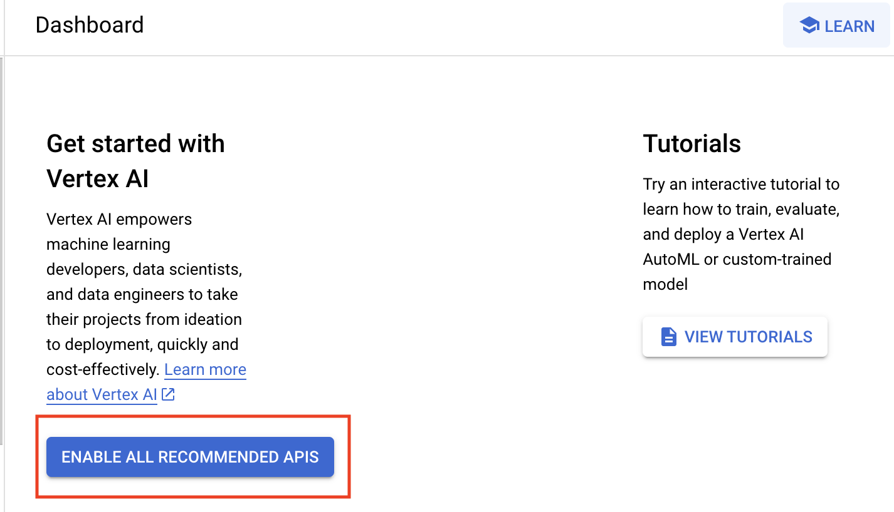

# Explore and Evaluate Models Using Model Garden

## Overview

You work for a real estate firm as a marketing analyst. Your company is intereseted in using Large Language Models to better help both home buyers and sellers who access their website seeking home mortgage information - (1) Mortgage calculations based upon current interest rates and (2) Brief text descriptions of homes they are interested in given their features. The realtors on your team are also interested in this information to better help them with pricing discussions with both buyers and sellers. You have been tasked to create prompts that can respond to mortgage calculations and to summarize text from very long home descriptions from your real estate site. Home descriptions are stored in a file in a Google Cloud storage bucket. 

You are not certain what tools exist on Google Cloud, but you know that you can explore Model Garden to explore available models for your use. Due to the time you have to implement a solution, you want to look for pre-built models that can be leveraged as much as possible. 

## Vertex AI

Vertex AI is Google Cloud's unified artificial intelligence platform for managing machine learning and generative AI projects. Vertex AI Model Garden is a collection of pre-trained machine learning models and tools that are designed to simplify the process of building and deploying machine learning models. Model Garden is a convenient and easy-to-use platform that can help you get started with machine learning quickly and easily.

## Model Garden

Model Garden provides a single place to search, discover, and interact with a wide variety of models from Google and Google partners. These models cover a wide range of use cases, including computer vision, natural language processing, and tabular data analysis. Model Garden also provides a variety of tools to help you use these models, including:
**Model cards**: Model cards provide detailed information about each model, including its accuracy, performance, and training data.
**Prompt design**: Prompt design allows you to interact with a model via a simple UI and tune the model with your own data.
**Deployment**: Model Garden can help you deploy your models to a production environment.

One of the availble models through Model Garden is the Natural Language API. The Cloud Natural Language API lets you extract entities from text, perform sentiment and syntactic analysis, and classify text into categories. In this lab, you explore Model Garden and how to use Generative AI studio to create and experiment with prompts for your use case. 

## Objectives

In this lab, you learn how to:
* Explore Vertex AI Model Garden to find the appropriate model for your use case.
* Incorporate Model Garden in your machine learning workflow
* Navigate the Gen AI Studio user interface
* Create text, chat, and code generation prompts for the Generative AI lab use case
* Run Python code in a Jupyter Notebook that uses the PaLM API

  
## Setup and Requirements


![[/fragments/startqwiklab]]


![[/fragments/cloudshell]]

1. In the Google Cloud console, from the Navigation menu (), select __Vertex AI__ from the __Artificial Intelligence__ section. 

2. From the Vertex AI dashboard, click the __Enable all Recommended APIs__ button. 



## Task 1: Explore Model Garden

To view the list of available Vertex AI and open source foundation, tunable, and task-specific models, go to Model Garden.

1. From the Vertex AI dashboard, in the __Tools__ pane on the left, click __Model Garden__.

#### The model categories available in Model Garden are:
   ---
| Category | Description | 
|---|---|
| Foundation models | Pretrained multitask large models that can be tuned or customized for specific tasks using Generative AI Studio, Vertex AI API, and the Vertex AI SDK for Python. |
| Fine-tunable models | Models that you can fine-tune using a custom notebook or pipeline. |
|Task-specific solutions | Most of these prebuilt models are ready to use. Many can be customized using your own data. |
---

Here are examples of Model Cards. Pick a Model Card from each category and explore it. For example, you could explore the Label Detector Zero-shot foundation model, which classifies images based on labels, represented as a list of text prompt strings, which are provided by the user, and calculates the confidence score of each labelâs presence in the image. You could use this model to input images of your housing inventory and classify a house based upon whether or not it was labeled as "close to shopping" or "not close to shopping". 

Or, you could explore the Task Sentiment analysis model, wihch inspects the given text and identifies the prevailing emotional opinion within the text, especially to determine a writer's attitude as positive, negative, or neutral. A use case could be the ability to identify customer complaints and provide timely support.

Placeholder for foundation model card


  
3. 


## Generative AI Studio
Gen AI Studio is a feature of Vertex AI. It makes writing and tuning prompts for text, chats, and code generation simple and intuative. 

## Task 2: Create text prompts for your Generative AI lab use case

Prompts concepts here.

3. In the __Tools__ pane on the left, click __Language__ from the __Generative AI Studio__ section. 


Then, click __Text Prompt__ on the Get Started page. 


Text Prompt Window

 

4. In the Prompt box type the following. and click __Submit__. Read the response. 

```
My credit score is 650
The home purchase price is 500,000
What is my estimated monthly mortgage payment on a 30 year loan at today's current interest rates?
```

5. Let's me more specific. Enter the following and click __Submit__. Here, you are adding one addtional line of text "Show me homes for sale in zip code 33020". Examine the response.

```
My credit score is 650
The home purchase price is 500,000
What is my estimated monthly mortgage payment on a 30 year loan at today's current interest rates?
Show me some homes for sale in zip code 33020
```
   
6. Enter the following and click __Submit__. Here, you are adding one line of text, "What cities are in area code 330320?" Examine the response.

```
My credit score is 650
The home purchase price is 500,000
What is my estimated monthly mortgage payment on a 30 year loan at today's current interest rates?
Show me some homes for sale in zip code 33020
What cities are in area code 330320?
```
Examine the response. 

7. Enter the following and click __Submit__. Here, you are modifying the text - adding a bit context. "Input" for the first line and "Output" for the last line.  Examine the response.

```
input: My credit score is 650
The home purchase price is 500,000
What is my estimated monthly mortgage payment on a 30 year loan at today's current interest rates?
Show me some homes for sale in zip code 33020
What cities are in area code 330320?
output:
```
The respose should be similar to what is shown below. 


8. The results are returned as Markdown. Click the __Markdown__ toggle to format the results. 

9. Click the __View Code__ button in the Gen AI Studio toolbar. Use this script to request a model response in your application.

 

10. Click the __Save__ button in the Gen AI Studio toolbar. Name the prompt anything you like. Something like `Real Estate Prompt`  would be good. Once saved, prompts will be available be available in the __My Prompts__ tab of the Language page.


## Task 3: Creating a Code Prompt

1. In the Tools pane on the left, click __Language__ from the __Generative AI Studio__ section as you did earlier. This time, click __Code Prompt__ on the Get Started page.


2. Ask the model to generate some code for you. Examine the results. 

```
Write Python code to show the calculation of mortgage rate?
```

Your response should resemble the following:

 


3. Save your prompt, name it something like `Mortgage Calculation`.


# Getting Started with the PaLM API

In this section, you learn to use the PaLM API from code. You will do this 3 ways: using cURL to make a REST request from the command line, using a Jupyter Notebook, and using a simple Python program. 

## Task 1. Create the Prompt

1. In the Prompt box type the following. and click __Submit__. Read the response. 

```
List the top selling homes in 33020 in 2023.
```
Your respnse should look similar to the below image:

 


2. In the Gen AI Studio toolbar, click on the __View Code__ button. Notice, a panel appears that allows you to select code in Python, Python Colab (_Jupyter_), and cURL. 


## Task 2. Running the Code in a Jupyter Notebook

1. In the Vertex AI __Tools__ pane on the left, click __Workbench__.

2. On the Workbench page, click on the __User Managed Notebooks__ tab. Then, click the __New Notebook__ button, and select __Python 3__ from the dropdown. Choose the region <ql-variable key="project_0.default_region" placeHolder="<filled in at lab start>"></ql-variable> and then choose the zone <ql-variable key="project_0.default_zone" placeHolder="<filled in at lab start>"></ql-variable>. Accept the rest of the defaults and click __Create__. 

__Note:__ It will take a couple minutes for the Workbench instance to be created. 

3. When your Workbench instance is ready, click on the __Open Jupyterlab__ link. This will open Jupyter Lab in a new tab. On the launcher page, click the __Python (Local)__ icon in the Notebook section. This will open a new Jupyter Notebook. 


4. In the first cell of you notebook run the following to install the latest version of AI Platform.

```
!pip install google-cloud-aiplatform --upgrade --user
```

5. When that command completes, you need to restart the Jupyter runtime. From the __Kernel__ menu, select __Restart Kernel__

6. Return to the tab with the Google Cloud Console. In the Vertex AI Tools pane, select __Language__ from the __Generative AI Studio__ section. Click on the __My Prompts__ tab, and then your __Test Prompt__ that you saved earlier. 


7. Click on the __View Code__ button, and then select the __Python Colab__ tab. Copy the code from step 2. Paste this code into the second cell in your Jupyter Notebook. Before you run it though, comment out or remove the first 2 lines. _These lines would be needed in Google Colab, but are not needed in Workbench. See the screenshot below._

8. Click the __Run__ button to run the code in that cell. The results should be similar to what is shown below. 


9. Try changing the prompt and the parameters and test the code again. For example, this time add the line "and their sales price" at the end of the sentence. The results should be similar to what is shown below.

 

## Task 4: Running the Python Code

1. Return the the Google Console and start Cloud Shell. 

2. You will want to run the code in a Python virtual environment. Run the following to create the virtual environment and activate it. 

```
pip install virtualenv
virtualenv genai-env
source genai-env/bin/activate
genai-env/bin/pip install google-cloud-aiplatform
```

3. Create a Python file for your code. 

```
touch main.py
```

4. Click the __Open Editor__ button and open the file you just created in the code editor. 

5. Return to your prompt in Gen AI Studio and copy the Python code into your file. 

6. Click the __Open Terminal__ button, and run the following code. 

```
python main.py
```


## Bonus: Here are some links to Vertex AI Model Garden
Vertex AI Model Garden website: https://cloud.google.com/model-garden
Vertex AI Model Garden documentation: https://cloud.google.com/vertex-ai/docs/start/explore-models
Vertex AI Model Garden blog post: https://cloud.google.com/blog/products/ai-machine-learning/vertex-ai-model-garden-and-generative-ai-studio


### **Congratulations!** You have used Model Garden and Generative AI studio to create and experiment with prompts for various generative AI uses cases. You also explored the Gen AI Studio UI, and created text and code prompts and chats. 


![[/fragments/endqwiklab]]

![[/fragments/copyright]]
