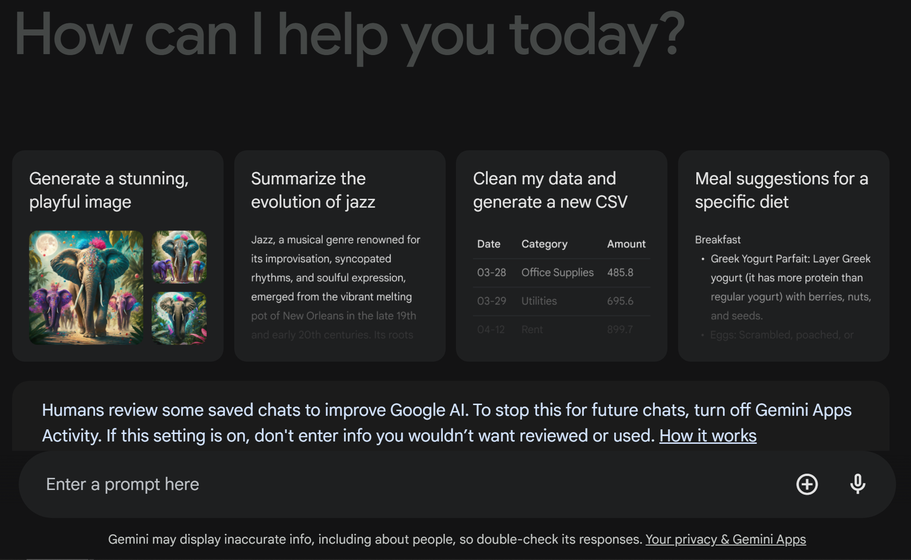

# Qwik Intro to Prompt Design 


## Overview


Use Case: Cymbal Solar is a energy company looking to upskill their team on Generative AI. They are particular interested in several key area: Project Management, Marketing, and Digital Transformation using Generative AI. They are currently a Google Cloud customer.

You are a Project Manager/Program Manager tasked with writing prompts to help your team xxxxxxx. You are somewhat familiary with using Gemini or Chat GPT or other Large Language Models by inputing text or images.

### Learning objectives

* Understand the fundamental concepts and techniques of effective prompt design.
* Learn various methods for crafting effective prompts.
* Develop the ability to create clear and concise prompts that leverage domain knowledge to elicit desired responses from Gemini.


### We will use Gemini as our Large Language Model.
<br> 



<br> 

There are various types of prompts used in AI, each serving a specific purpose:

| Prompt Type       | Description                                                                                       |
|-------------------|---------------------------------------------------------------------------------------------------|
| Zero-shot prompts | Prompts where the model is given a task without any examples or context, relying on its training. |
| One-shot prompts  | Prompts that provide one example to guide the model on how to generate the desired response.      |
| Few-shot prompts  | Prompts that include a few examples to illustrate the task, helping the model understand the context and expectations.  |

<br> 

## Zero-shot prompting

Below is an example of zero-shot prompting, where you do not provide any examples to the LLM within the prompt itself. You haven't provided any specific examples or training data about how Generative AI can be used in the solar installation industry, yet you're asking the AI to generate relevant information based on its general knowledge and understanding.

Copy this prompt into Gemini and review the output. 

```
Cymbal Solar is our company. We need to upskill our team on Generative AI. How can Generative AI help this solar installation company?

```
<br>
Here’s why the above prompt for Cymbal Solar qualifies as a zero-shot prompt:

| Aspect            | Description                                                                                                   |
|-------------------|---------------------------------------------------------------------------------------------------------------|
| Clear Context     | The prompt specifies the company (Cymbal Solar) and its goal (upskilling the team on Generative AI).          |
| Focused Question  | It asks a specific question about how Generative AI can benefit the company.                                  |
| Expected Output   | The response should be detailed and structured, providing a comprehensive overview of the potential benefits.  |
| Zero-shot Prompt  | It provides no examples or additional context, relying on the model's general knowledge to generate the response. |


<br> 

## One-shot prompting

Below is an example of one-shot prompting, where you provide one example to the LLM within the prompt to give some guidance on what type of response you want. A one-shot prompt is a type of prompt designed to elicit a single, complete, and concise response. It usually includes both the question and the expected format of the answer, providing enough context to ensure the response is targeted and relevant. 

Copy this prompt into Gemini and review the output. 

```
Cymbal Solar, a leading solar installation company, seeks to upskill its team on Generative AI. Explain how Generative AI can benefit Cymbal Solar in improving its operations, customer engagement, and overall efficiency.

```

<br>

Here’s why the above prompt for Cymbal Solar qualifies as a one-shot prompt:
| Aspect            | Description                                                                                                   |
|-------------------|---------------------------------------------------------------------------------------------------------------|
| Clear Context     | The prompt specifies the company (Cymbal Solar) and its goal (upskilling the team on Generative AI).          |
| Focused Question  | It asks a specific question about how Generative AI can benefit the company.                                  |
| Expected Output   | The response should be detailed and structured, providing a comprehensive overview of the potential benefits.  |
| One-shot Prompt   | It expects one comprehensive response without providing examples, relying on the responder's knowledge and understanding. |

<br>

## Few-shot prompting

A few-shot prompt provides a few examples (with additional instructions) to guide the LLM on how to structure the answer. Here’s how you can structure a few-shot prompt for Cymbal Solar:

Copy this prompt into Gemini and review the output. 

```
Cymbal Solar, a leading solar installation company, seeks to upskill its team on Generative AI. Explain how Generative AI can benefit Cymbal Solar in improving its operations, customer engagement, and overall efficiency.For predictive maintenance, Generative AI can analyze data from sensors on the solar installations to predict equipment failures before they happen. This proactive approach allows Cymbal Solar to perform maintenance activities during scheduled downtimes, reducing unexpected outages and extending the lifespan of the equipment.

Now, your turn:

Explain how Generative AI can benefit Cymbal Solar in improving its operations, customer engagement, and overall efficiency.
```

<br>

Here’s why the above prompt for Cymbal Solar qualifies as a few-shot prompt:

| Aspect            | Description                                                                                                   |
|-------------------|---------------------------------------------------------------------------------------------------------------|
| Clear Context     | The prompt specifies the company (Cymbal Solar) and its goal (upskilling the team on Generative AI).          |
| Focused Question  | It asks a specific question about how Generative AI can benefit the company.                                  |
| Expected Output   | The response should be detailed and structured, providing a comprehensive overview of the potential benefits.  |
| Few-shot Prompt   | It includes an example response about predictive maintenance, guiding the responder on how to approach the task.  |


<br>

### Comparison between zero-shot, one-shot, and few-shot prompting methods


| Prompting Method | Description                                                                                                     |
|------------------|-----------------------------------------------------------------------------------------------------------------|
| Zero-shot        | More open-ended and can provide creative answers.                                                               |
| One-shot         | Provides one example to guide the model, resulting in more predictable answers consistent with the example.     |
| Few-shot         | Provides a few examples to guide the model, resulting in more predictable and consistent answers.               |
| Recommendation   | The choice of prompt technique depends on your goal. Zero-shot is ideal for creative answers, while one-shot and few-shot are better for predictable and consistent responses. Including too many examples can lead to the model mimicking or overfitting the examples, rather than addressing the specific task. |

 <br> 
 <br> 
 

## Task #1. Crafting an Effective Prompt for Cymbal Solar

Objective:
To create an effective prompt that guides the Generative AI in providing valuable insights and recommendations for Cymbal Solar.

| Step                | Description                                                                                                                           |
|---------------------|---------------------------------------------------------------------------------------------------------------------------------------|
| **Understand the Context** | Identify the key goals and needs of Cymbal Solar. The company wants to upskill its team on Generative AI and explore how it can benefit their operations. |
| **Define the Specific Task** | Determine what you want the AI to provide. For Cymbal Solar, you might want insights on how Generative AI can be applied to their specific needs, such as improving operations, customer engagement, and efficiency. |
| **Choose the Prompt Type** | Decide whether you need a zero-shot, one-shot, or few-shot prompt based on the complexity of the information you want and the examples you wish to provide. |
| **Draft the Prompt** | Write a clear and concise prompt that specifies the context, the task, and the expected outcome. Ensure that the prompt is focused and provides enough detail for the AI to generate a relevant response. |
| **Review and Refine** | Check the prompt for clarity and completeness. Make sure it aligns with the goal and provides sufficient information to elicit a detailed and useful response. |
| **Example Prompts** | Provide example prompts for different types (zero-shot, one-shot, few-shot) to illustrate how the prompt might be constructed. |


Example Prompts:

Zero-shot Prompt:

```
Cymbal Solar is a solar installation company looking to upskill its team on Generative AI. Explain how Generative AI can benefit the company in terms of improving operations, customer engagement, and overall efficiency.
```

One-shot Prompt:

```
Cymbal Solar is a solar installation company aiming to enhance its team’s skills in Generative AI. Here is an example of how Generative AI can help in predictive maintenance: By analyzing data from sensors on solar installations, Generative AI can predict equipment failures before they occur, allowing for proactive maintenance. Now, explain how Generative AI can also benefit Cymbal Solar in other areas such as operations, customer engagement, and efficiency.
```

Few-shot Prompt:

```
Cymbal Solar wants to upskill its team on Generative AI. Here are a few ways Generative AI can benefit the company:

1. **Design Optimization**: Generative AI can optimize solar panel layouts by analyzing site-specific data, improving energy capture, and reducing installation costs.

2. **Predictive Maintenance**: AI can predict equipment failures before they happen by analyzing sensor data, allowing for proactive maintenance.

Now, provide additional examples of how Generative AI can benefit Cymbal Solar in improving operations, customer engagement, and overall efficiency.
```

## Task #2. Write a Prompt to Create Levels of Technical Knowledge for Generative AI:

Next, ask the model to create four levels of technical knowledge for Generative AI and put the results into a table. This will allow us to create categories we can use later. 

### Prompt
```
Create four levels of technical knowledge for Generative AI and put the results into a table.

```

Revew the four levels. Export the results to a table. Note: Your output response may vary.


| Level             | Description                                                                                                            |
|-------------------|------------------------------------------------------------------------------------------------------------------------|
| **Beginner**      | Basic understanding of Generative AI concepts, such as the ability to describe what Generative AI is and its general uses. No in-depth knowledge of algorithms or technical details. |
| **Intermediate**  | Familiarity with core Generative AI techniques like GPT, BERT, and their applications. Understanding of basic concepts such as tokenization and training data, with some practical experience. |
| **Advanced**      | In-depth knowledge of various Generative AI models and architectures, including their underlying algorithms. Ability to fine-tune models, perform hyperparameter tuning, and understand model performance metrics. |
| **Expert**        | Expertise in designing, implementing, and optimizing advanced Generative AI systems. Deep understanding of cutting-edge research, model innovations, and the ability to contribute to the development of new Generative AI techniques. |


<br> 
<br> 

## Congratulations!

In this lab you learned how to:

* Understand the fundamental concepts and techniques of effective prompt design.
* Learn various methods for crafting effective prompts.
* Develop the ability to create clear and concise prompts that leverage domain knowledge to elicit desired responses from Gemini.


![[/fragments/endqwiklab]]

