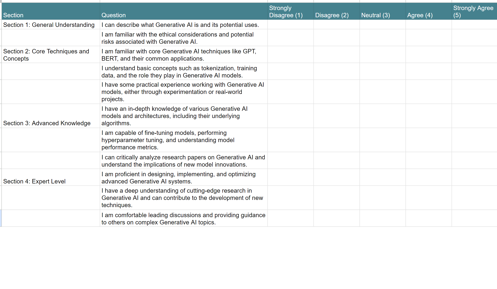

# Using Gemini and Google Toolsets for Survey Creation and Self-Assessment Analysis


## Overview


Use Case: You are a Project Manager/Program Manager tasked with writing prompts to understand the leveels of Technical Knwoeldge for Generative AI and to ask the Large Language Model to create a survey that your team can use for self-assessment based on the levels of technical knowledge. 

Using the model's survey suggestion, you will then create a Google Form. For information on how to create a Google Form, please see XXXXX.

### Learning objectives

* Write a prompt to reate levels of technical knowledge for Generative AI.
* Write a prompt to create a survey using the levels of technical knowldge for Generative AI.
* Create a Google Form, administer the survey, analyze survey results.


## Task #1. Write a Prompt to create Levels of Technical Knowledge for Generative AI:

Ask the model to create four levels of technical knowledge for Generative AI and put the results into a table. This will allow us to create categories we can use later. Note: Your output may vary.

### Prompt
```
Create four levels of technical knowledge for Generative AI and put the results into a table.

```

Revew the four levels. Export the results to a table. Note: Your output response may vary.


| Level             | Description                                                                                                            |
|-------------------|------------------------------------------------------------------------------------------------------------------------|
| **Beginner**      | Basic understanding of Generative AI concepts, such as the ability to describe what Generative AI is and its general uses. No in-depth knowledge of algorithms or technical details. |
| **Intermediate**  | Familiarity with core Generative AI techniques like GPT, BERT, and their applications. Understanding of basic concepts such as tokenization and training data, with some practical experience. |
| **Advanced**      | In-depth knowledge of various Generative AI models and architectures, including their underlying algorithms. Ability to fine-tune models, perform hyperparameter tuning, and understand model performance metrics. |
| **Expert**        | Expertise in designing, implementing, and optimizing advanced Generative AI systems. Deep understanding of cutting-edge research, model innovations, and the ability to contribute to the development of new Generative AI techniques. |


<br> 
<br> 

## Task #2. Write a Prompt to create a survey using the levels of technical knowldge for Generative AI.

This prompt asks the model to write a survey based on the four levels of technical knowledge of Generative AI it generated. 

### Step 1: Copy the previous prompt output of four levels of technical knowledge table above and paste into Gemini. Write the prompt below, then paste in the output results from Task #1.


### Prompt
```
Write a survey that I can administer to my team so that we can assess their levels of technical knowledge on Generative AI. Put the survey into a table for export. 

Once we have the survey built and administered, our goal is to analyze the survey results and have you, Gemini, create a training plan. 
 
Here are the four levels: LevelDescriptionBeginnerBasic understanding of Generative AI concepts, such as the ability to describe what Generative AI is and its general uses. No in-depth knowledge of algorithms or technical details.IntermediateFamiliarity with core Generative AI techniques like GPT, BERT, and their applications. Understanding of basic concepts such as tokenization and training data, with some practical experience.AdvancedIn-depth knowledge of various Generative AI models and architectures, including their underlying algorithms. Ability to fine-tune models, perform hyperparameter tuning, and understand model performance metrics.ExpertExpertise in designing, implementing, and optimizing advanced Generative AI systems. Deep understanding of cutting-edge research, model innovations, and the ability to contribute to the development of new Generative AI techniques.

```

After Gemini creates the survey into a table, export to Google Sheets by clicking "Export to Sheets". Note that there will be now color-coded header. This is added for visual XXX.


 

### Output - Survey


## Task 3. Use Google Forms to Create and Administer the Survey

This prompt asks the model to write a survey based on the four levels of technical knowledge of Generative AI it generated. 

### Step 1: Copy the previous prompt output of four levels of technical knowledge table above and paste into Gemini. Write the prompt below, then paste in the output results from Task #1.


 ### Step 1: Copy and paste the previous prompt four levels of technical knowledge table above and paste into Gemini. 

This prompt asks the model to write a survey based on the four levels of technical knowledge of Generative AI it generated. 


Show drafts


### Prompt
```
Create four levels of technical knowledge for Generative AI and put the results into a table.

```

Revew the four levels. Export the results to a table. Note: Your output response may vary.

## Congratulations!

In this lab you learned how to:

* Understand the fundamental concepts and techniques of effective prompt design.
* Learn various methods for crafting effective prompts.
* Develop the ability to create clear and concise prompts that leverage domain knowledge to elicit desired responses from Gemini.


![[/fragments/endqwiklab]]

