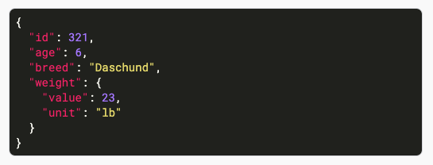

# Markdown Template Lab
## General Guidelines
- Try to begin with an imperitive (Create, Configur, etc.), but is not required.
- Use title case.
- Include any service names or programming languages that are a key aspect of the lab or that distinguish it from other labs. 
- Always follow the reference guidelines at go/cloud-branding. Use the short form in the lab guide title, and then use the full name on first reference in the body of the lab. 

### Give learners a story to follow but keep it simple
 * Combine learning objectives to define scenario/story.
    * Incorporate decision points (e.g. alternatives) and pain points with solutions.
    * Include the why, in addition to the how and what.
    * Useful story arc:
        *   Start with the problem.
        *   Follow immediately by stating the solution.
        *   Explain any concepts needed to implement the solution.
        *   Provide tasks that implement the solution.
        *   End with a clear accomplishment (highlight it!).
        *   Review what they accomplished and how the skills are applicable to
            other scenarios.
    * However, remember that simple is always better!
  * Design labs to help learners become problem-solvers and develop agency.
    * Clearly identify the problem to be solved and the skills needed to solve
        it.
    * Highlight which skills they already have that can be applied to the
        problem (e.g. learned from a previous task, or lab in quest).
* Learners should reach aha! moment
    * Design the project and tasks to help learners gain insight into process
        and develop transferable skills that apply to a range of problems and
        scenarios.


 More details on how to use markdown in your lab can be found here: labs/reference-MD-lab

## GSP0000

![[/fragments/labmanuallogo]]


Lab manuals are written in simple present tense, second person (*you* instead of *we*). 

## Overview


- Provide a description (1–2 paragraphs) of the lab. The overview can include:
- The lab scenario
- A diagram of the architecture that the lab will create
- Other conceptual information about the technologies used in the lab 

Keep the conceptual information brief and relevant to the goals of this lab. You can link to concept topics in documentation for in-depth information. Try to cover the WHY and HOW as well as WHAT the student will be doing.

Example:
In this lab, you use Datastore and App Engine to develop a backend service with real-time synchronization and email notifications. 


### What you'll learn or Objectives
<!-- 
Use "What you'll learn" or "Objectives" title - whatever works for your lab 
 -->
- List high-level tasks that the student will accomplish in the lab. 
- Include an introductory phrase, such as “In this lab, you learn how to perform the following tasks,” and end with a colon. 
- Begin each objective with an imperative verb (Create, Configure, etc.)
- Use simple present tense.
- DO use ending punctuation. 
 - This is a change from previous guidelines. Because each objective is a complete sentence, it should have ending punctuation. 
- Don’t include low-level actions.
- Don’t make assurances about what the student will be able to do after finishing the lab.

**Example**
In this lab, you learn how to perform the following tasks: 
- Create a network. 
- Launch an instance in the network. 


## Prerequisites

For self-paced labs offered in the public catalog, a specific lab cannot be required to be completed prior to taking the lab you’re writing, only suggested. If you’re creating a quest, assume the labs will be taken out of order. Make sure the labs will make sense if this happens.


## Setup
<!-- Most labs require all three fragments, but your lab may not. For example, might not need to use the `cloudshell` fragment if the lab instructions don't have CLI commands to run. -->

![[/fragments/startqwiklab]]

![[/fragments/gcpconsole]]

![[/fragments/cloudshell]]

<!--
Tasks
Tasks represent the high-level organization of the lab procedure. Number the tasks to provide context for learners. 
-->
## Task 1. Task title
- Succinctly describe the task. 
- Include the word “Task” and the task number. 
- Begin with an imperative (Create, Configure, etc.).
- Use sentence case. 

### Task content
- For each task, write a short summary of what the learner will accomplish. 
- Use simple present tense.
- Include conceptual information if it helps learners understand the task and perform it more successfully. 
- Do not include steps in the task content. 
Example:
In this task, you set up the software and source code needed to develop the app.

<!-- Subtasks
Create one level of subtasks (procedures) under each task to further organize the lab guide.
-->
### Subtask title

- Begin with an imperative (Create, Configure, etc.).
- Use sentence case. 
- Do not use ending punctuation.
  Example: 
  Clone the repository

#### SUBTASK CONTENT
Subtasks contain the specific steps (procedures) that the learner performs. It may take some effort to create the appropriate number of subtasks: the steps should be divided into logical groups, but no individual subtask should be unusually long.

#### PROCEDURE GUIDELINES
- Present each step in chronological order. 
- Number each step.
  - Best practice is to use "1." for each step, so you can add, delete, or rearrange steps without having to renumber them. The steps will render with the correct numbers. 
- Use simple present tense, second person (*you* instead of *we*).
- Be conversational without being frivolous.
- Include an imperative verb (Examples: click, copy, press, etc.) in each step. 
- Include some user action (interaction with the user interface) in each step:
  -  Mental actions, such as deciding, are not user actions. 
  -  Computer actions, such as results, are not user actions. 

Combining actions
- In general, use a separate step for each user action. 
- When a UI surface (screen or dialog box) contains multiple user actions, combine them if they are short and logically related. For three or more actions, use a table (see samples below). 
- Do not combine actions that appear on different UI surfaces. 

Documenting code  
- To introduce code for the user to enter, it's best to begin the step with the purpose, like this:  
"To list available regions, execute the following command:"   
- AVOID using phrases like this: 
"You can list available regions by executing the following command:" 

Use the <ql-codeb-lock> tag to create the codeblock students can copy with a __Copy__ button right in the instructions.

<ql-code-block>
 sudo apt-get update
 </ql-code-block>

 To add output code block use `ql-code-block`. Output code blocks contain the results of previous commands, such as terminal output - things that are not meant to be copied. An output code-block does not have a copy button, and has different styling.

```
<ql-code-block lang="json" output>
  {
    "id": 321,
    "age": 6,
    "breed": "Daschund",
    "weight": {
      "value": 23,
      "unit": "lb"
    }
  }
</ql-code-block>
```



Do not use an image of output code. Screenreaders cannot read the output, and the text inside the image is very, very small in the UI.

#### Images need alt text

If you add images to your lab manual, you must also add meaningful alt text, to the markdown. See above example.


## Task 2. NOTES
Use <ql-infobox> and </ql-infobox> to create a note. 
- Include a bold, title case heading. 
- Headings include "Best practices", "Note", and "Important." 
-  Insert a colon after the heading.

<ql-infobox>
<strong>Note:</strong> HTML code must be used in an infobox
</ql-infobox>


## Task 3. SAMPLE TEXT
Copy/paste the samples in this section into your lab and modify as appropriate. 

<!--Google Cloud Console UI instructions-->
1. In the console, on the **Navigation menu** (), click **APIs and services > Library**.
<!--  
If subsequent steps are still in the console, you can omit that part of the instruction, as follows:
-->
1. On the **Navigation menu** (), click **Storage**.  
<!--
You don’t have to include an image of the menu icon at every mention; use your judgment to ensure that learners will be familiar with the location of unlabeled controls.
-->

1. For **Name**, type **test-instance-group-1** 
<!--When a step ends with text the learner should type, don't use ending punctuation. -->
1. On the **Create an instance** page, specify the following, and leave the remaining settings as their defaults:  

| Property | Value |  
| --- | --- |  
| Google Service Account Name | **kubernetes-anthos-sa** |  
| Assigned IAM Role | **iam.workloadIdentityUser** |  
| Kubernetes Service Account Name | **ksa-anthos** |  
| Kubernetes Namespace | **anthos-challenge** |  
<!--When the learner has to enter three or more values in a row, use a table. For the final step, such as "Click Create," use a separate step.  -->
1. Click **Start**.
<!--Use sentence case for all labels, even if the UI label is all caps.  -->
1. On the Google Cloud Console title bar, click **Activate Cloud Shell** (). 

Do not use an image of a table! The contents of the table cannot be read by a screen reader, and the text renders very, very small.


## Congratulations!

This should be a brief summary of what the student accomplished in the lab. 

### Finish your quest
<!--
Example text below. If this lab is part of a quest, replace text with your quest name and link + the enrollment link to a lab in the quest. **Do not add this section if part of a skill badge quest**
-->
This self-paced lab is part of the [Google Cloud Essentials](https://google.qwiklabs.com/quests/23) quest. A quest is a series of related labs that form a learning path.  [Enroll in this quest](https://google.qwiklab.com/learning_paths/23/enroll) and get immediate completion credit for taking this lab.  [See other available quests](https://google.qwiklabs.com/catalog).

### Take your next lab

<!--
Example text below. If this lab is part of a quest, replace text with your quest name and link + a link to a lab in the quest - sequential order if possible, but not necessary. **Do not add this section if part of a skill badge quest**
-->
Continue your quest with  [Getting Started with Cloud Shell and gcloud](https://google.qwiklabs.com/catalog_lab/320), or check out these other Google Cloud Skills Boost labs:

*  [Provision Services with Google Cloud Marketplace](https://google.qwiklabs.com/catalog_lab/339)

### Next Steps / Learn more


![[/fragments/TrainingCertificationOverview]]


**Manual Last Updated: September 16, 2022**

**Lab Last Tested: July 29, 2022**

![[/fragments/copyright]]
