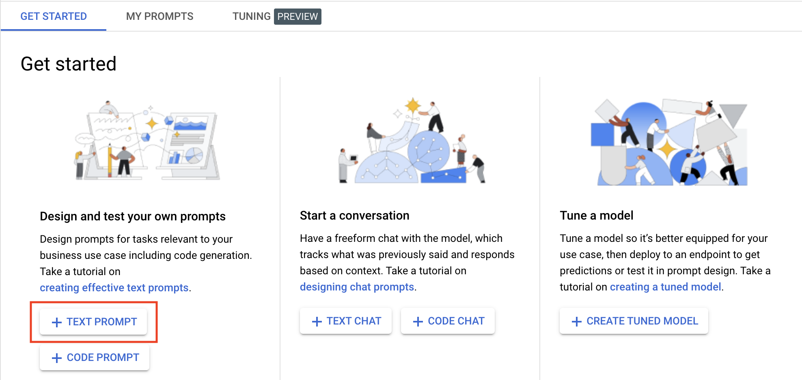
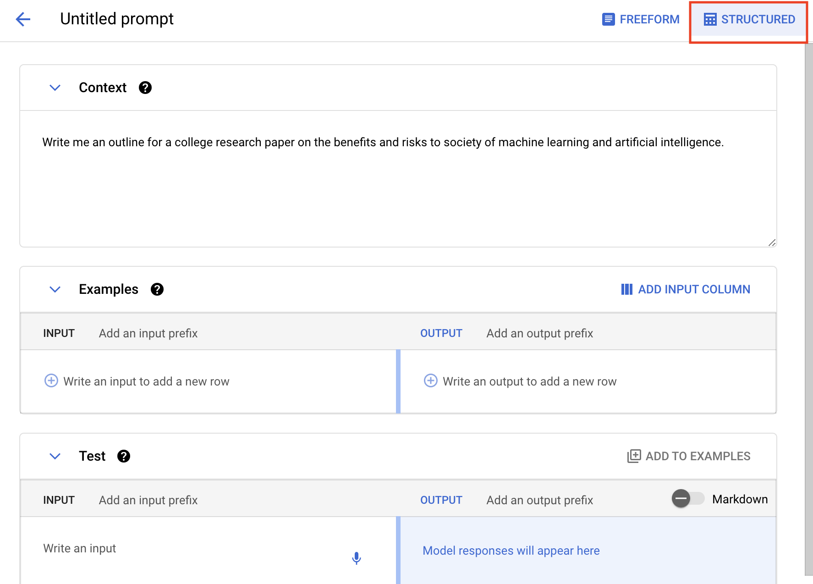
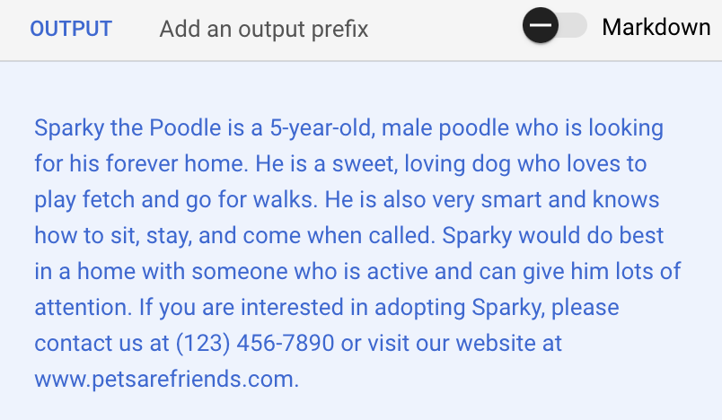
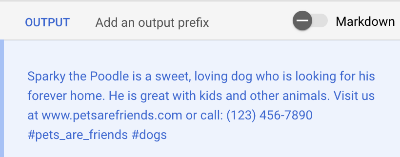
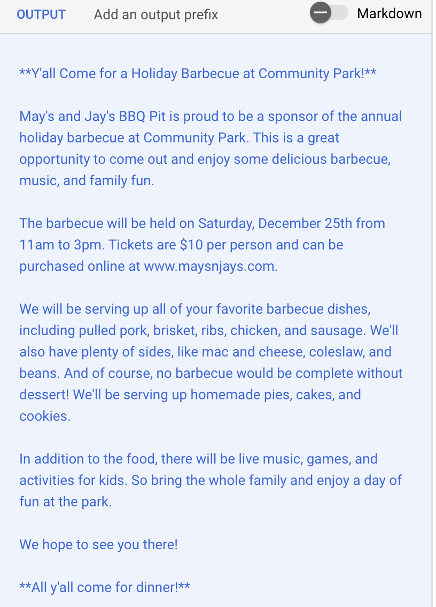
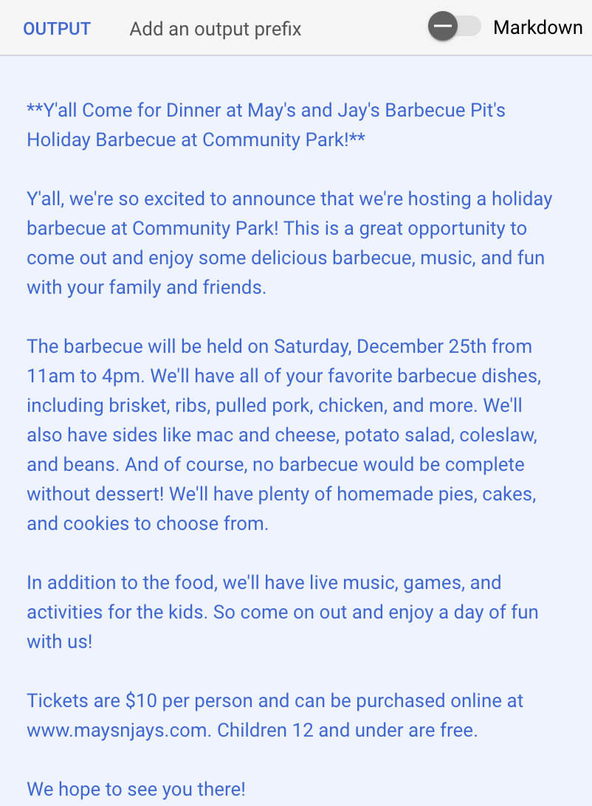
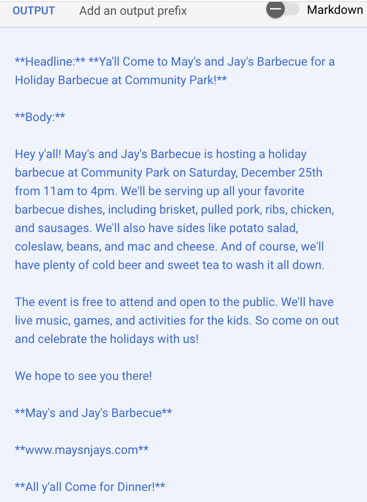

# Prompt Design for Text Generation in Gen AI Studio

## Overview

When you ask the PaLM API a question, it will always give an answer. However, in a real-world scenarios, you want to tailor that answer for your organization or use case. Prompt design is a way of doing just that. 

In this lab, you learn to write prompts that control model output, add context and examples to tailor output specific to you, and change model parameters to make the model more or less creative. 


## Objectives

In this lab, you learn how to:
* Write prompts in different ways to control output
* Add context and examples to customize output for your idividual uses cases
* Experiment with PaLM API parameters to see how they change model output


## Setup and Requirements


![[/fragments/startqwiklab]]


![[/fragments/cloudshell]]


## Task 1: Experimenting with Prompts

1. In the Google Cloud console, from the Navigation menu (), select __Vertex AI__ from the __Artificial Intelligence__ section. 

2. From the Vertex AI dashboard, click the __Enable all Recommended APIs__ button. 


3. In the __Tools__ pane on the left, click __Language__ from the __Generative AI Studio__ section. Then, click __Text Prompt__ on the Get Started page. 



3. In the Prompt box type the following. and click __Submit__. Read the response. 

```
What is machine learning?
```

4. Now, try the following prompt. 

```
Summarize key dates in the development of machine learning.
```

5. Now, the following one, but change the __Token Limit__ in the properties pane to 1024 before you submit it. 

```
Write me an outline for a college research paper on the benefits and risks to society of machine learning and artificial intelligence. 
```

6. Try a few more prompts on your own and examine the results. 

__Note:__ As you can see, the way you write a prompt has a huge impact on the results. 

## Task 2: Structure Prompts in Gen AI Studio

1. In Gen AI Studio, click the __Structured__ button in the toolbar. 



__Note:__ The Structured UI allows you to enter context and examples when designing prompts. 

2. Make sure there is no text in the __Context__ box. Then, in the __Test__ section, write the following prompt and submit it. Examine the results. 

```
Write a social media post about how great Sparky the Poodle is. 
```

3. Now, add the following to the __Context__ section, and test the same prompt. 

```
You work for an animal shelter and write social media posts about dogs and cats that need new homes. 
```

__Note:__ The context should have a big impact on the results and is a key way to get the model to output something relevant to your use case. 

4. Let's add some more context. In addition to what is already there, add the following. Then, test the prompt again.  

```
Your web site is: www.petsarefriends.com.

You phone number is: (123) 456-7890.
```

__Note:__ The results should be similar to what is shown below. This would be much better for the animal shelter than the results generated without the context. 

Results:


Examples are a way of getting the model to write in your style. You are just giving sample prompts along with how you would write the output. 

5. Let's add some examples. In the __Examples__ section, add the following to the __Input__ box.

```
Write me a post about Firecracker, a 6-year old Schnauzer whose owner passed away. 
```

6. Add the following to the __Output__ box. Then, test the results. 

```
Little Firecracker is a playful Schnauzer who needs her forever home. Great with kids and loves to play. Visit us at www.petsarefriends.com or call: (123) 456-7890 #pets_are_friends #dogs
```
The resuts should be similar to the following:



7. Add another example, this time for a cat. Then, experiment with different prompts to see the results. Something like the following:

__Input:__
```
Write me a post about Tony the Persian cat who was a stray. 
```
__Output:__
```
Tony is a quiet Persian cat who loves being petted and is is good with kids. Visit www.petsarefriends.com for pictures. Call (123) 456-7890 to adopt. #pets_are_friends #cats
```

8. Save your prompt, name it something like `Pets Prompt`. 

## Task 3: Experimenting with PaLM API Parameters

1. Create a new __Text Prompt__, and click on the __Structured__ button. 

2. In the __Test__ section, add the following input and test it. Examine the results. 

```
Write me a blog post promoting a holiday barbecue at Community Park. 
```

3. Now, add the following context and test it again. 

```
You work for May's and Jay's BBQ Pit. A barbecue restaurant in San Antonio, Texas. The website is: www.maysnjays.com and your slogan is: "All y'all Come for Dinner".  You like to use Southern, Texas slang when you write.
```
Results:


4. Temperature is a way of making the model more or less creative. The lower the value the less creative the model will be. Set the Temperature to `0.1`.

5. PaLM is really a very sophisticated language model. For the PaLM 2 model, a token is equivalent to about 4 characters. 100 tokens are about 60-80 English words. Top-P and Top-K are ways of controlling which tokens to choose next. Setting these values low means PaLM is more likely to select the token with the highest probability of being correct. That is, it will be less creative. Set the value of Top-K to `3`, and the value of Top-P to `0.1`.

6. Test the prompt with these settings and examine the results. If you submit multiple times, the same (_or almost the same_) results should be returned. 

Results:


__Note:__ Low values for Temperature, Top-K, and Top-P are appropriate when you want the model to return "correct" answers. That is, be less creative. 

7. Now, set Temperature, Top-K, and Top-P to their highest values. Submit the request a few times. Now, you should see different, more creative responses. 

Results:


8. Experiment with the settings and test the results. 

9. Change the context and prompt to something more related to a use case or interest that you have. 


### **Congratulations!** You have to written prompts that control model output, added context and examples to tailor output specific to your organization, and changed model parameters to make the model more or less creative. 


![[/fragments/endqwiklab]]

![[/fragments/copyright]]
