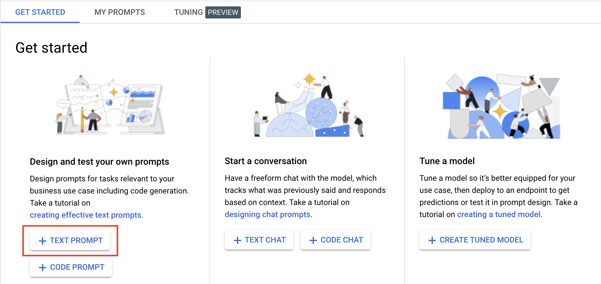

# Getting Started with the PaLM API

## Overview

In this lab, you learn to use the PaLM API from code. You will do this 3 ways: using cURL to make a REST request from the command line, using a Jupyter Notebook, and using a simple Python program. 

## Objectives

In this lab, you learn how to:
* Use cURL to invoke the PaLM REST API
* Run Python code in a Jupyter Notebook that uses the PaLM API
* Run a simple Python program that uses the PaLM API


## Setup and Requirements


![[/fragments/startqwiklab]]


![[/fragments/cloudshell]]


## Task 1. Creating a Prompt

1. In the Google Cloud console, from the Navigation menu (), select __Vertex AI__ from the __Artificial Intelligence__ section. 

2. From the Vertex AI dashboard, click the __Enable all Recommended APIs__ button. 


3. In the __Tools__ pane on the left, click __Language__ from the __Generative AI Studio__ section. Then, click __Text Prompt__ on the Get Started page. 



3. In the Prompt box type the following. and click __Submit__. Read the response. 

```
List some good action movies that the whole family can watch?
```

4. In the Gen AI Studio toolbar, click on the __View Code__ button. 


5. Notice, a panel appears that allows you to select code in Python, Python Colab (_Jupyter_), and cURL. 


## Task 2. Using the PaLM REST API 

1. Click the __CURL__ button and copy the code in step 3 to the clipboard. _You will run the code in Cloud Shell, so the first 2 steps will not be required._


2. On the Google Cloud console title bar, click __Activate Cloud Shell__ (). If prompted, click __Continue__.

3. Paste the code in the Cloud Shell terminal and hit __Enter__ to run it. If you're prompted to authorize the request, then do so. The results should be as shown below.


4. In a text editor of your choice, make change to the prompt in the code and test it agina using cURL. 

5. In Cloud Shell, type `exit` and hit the Enter key to close it. 

6. In GenAI Studio, save your prompt with the name `Test Prompt`.


## Task 3. Running the Code in a Jupyter Notebook

1. In the Vertex AI __Tools__ pane on the left, click __Workbench__.

2. On the Workbench page, click on the __User Managed Notebooks__ tab. Then, click the __New Notebook__ button, and select __Python 3__ from the dropdown. Choose the region <ql-variable key="project_0.default_region" placeHolder="<filled in at lab start>"></ql-variable> and then choose the zone <ql-variable key="project_0.default_zone" placeHolder="<filled in at lab start>"></ql-variable>. Accept the rest of the defaults and click __Create__. 

__Note:__ It will take a couple minutes for the Workbench instance to be created. 

3. When your Workbench instance is ready, click on the __Open Jupyterlab__ link. This will open Jupyter Lab in a new tab. On the launcher page, click the __Python (Local)__ icon in the Notebook section. This will open a new Jupyter Notebook. 


4. In the first cell of you notebook run the following to install the latest version of AI Platform.

```
!pip install google-cloud-aiplatform --upgrade --user
```

5. When that command completes, you need to restart the Jupyter runtime. From the __Kernel__ menu, select __Restart Kernel__

6. Return to the tab with the Google Cloud Console. In the Vertex AI Tools pane, select __Language__ from the __Generative AI Studio__ section. Click on the __My Prompts__ tab, and then your __Test Prompt__ that you saved earlier. 


7. Click on the __View Code__ button, and then select the __Python Colab__ tab. Copy the code from step 2. Paste this code into the second cell in your Jupyter Notebook. Before you run it though, comment out or remove the first 2 lines. _These lines would be needed in Google Colab, but are not needed in Workbench. See the screenshot below._


8. Click the __Run__ button to run the code in that cell. The results should be similar to what is shown below. 


9. Try changing the prompt and the parameters and test the code again. 


## Task 4: Running the Python Code

1. Return the the Google Console and start Cloud Shell. 

2. You will want to run the code in a Python virtual environment. Run the following to create the virtual environment and activate it. 

```
pip install virtualenv
virtualenv genai-env
source genai-env/bin/activate
genai-env/bin/pip install google-cloud-aiplatform
```

3. Create a Python file for your code. 

```
touch main.py
```

4. Click the __Open Editor__ button and open the file you just created in the code editor. 

5. Return to your prompt in Gen AI Studio and copy the Python code into your file. 

6. Click the __Open Terminal__ button, and run the following code. 

```
python main.py
```


### **Congratulations!** You have used the PaLM API from code. You did this 3 ways: using cURL to make a REST request from the command line, using a Jupyter Notebook, and using a simple Python program.  


![[/fragments/endqwiklab]]

![[/fragments/copyright]]
